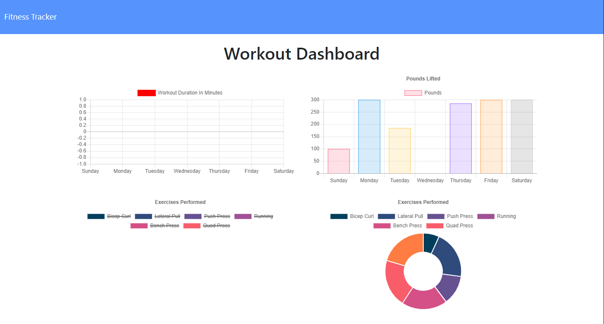

# Fitness Tracker

## General 📖
---    
- Author:         Brandon Haley
- Email:          Kyle7286@gmail.com
- Github:         https://github.com/Kyle7286/
- Repo:           https://github.com/Kyle7286/fitness-tracker
- Deployed:       

## About/Purpose ❔
---
A simple workout & exercise tracker which allows you to record your sessions and displays a visual representiation of your historical data.

## Installation 💽
---
Nothing to install

## How to Use ✔️
---
1. Navigate to deployed website
2. Create a new workout
3. Fill out the form during your workout
4. Complete or continue the workout
5. Go to dashboard page to view more details about your historical data

## Takeaways 🥡
--- 
* Gained more confidence deploying to heroku
* Gained more confidence with MongoDB
* Realized the differences between noSQL and SQL

## Screenshot/Gif 📊
---

## Thank you 👍 
---
Thank you for your time reviewing my project/code!